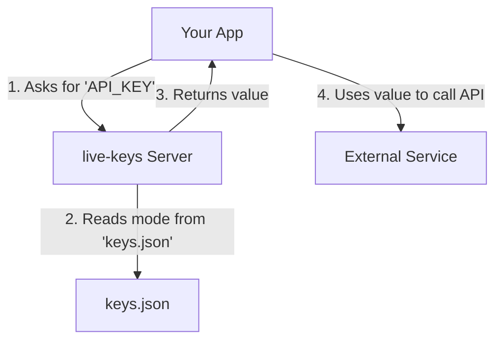

# live-keys

*Designed to make building in public easier*

[](https://github.com/computerlegs/live-keys/releases)
[](LICENSE)

`live-keys` is a lightweight Express-based tool that helps you build in public safely. It runs as a separate local server, acting as a simple proxy for your API keys, preventing them from being exposed during live streams, videos, or presentations.


---

## About The Project

You should use this tool **any time your screen, terminal, or browser's developer tools might be visible to others.** This includes live streams, recorded videos, pair programming sessions with external collaborators, or any situation where you are sharing your development environment publicly.

### Target Audience
*   **Live Coding Streamers and YouTubers:** The primary audience, who can code with real APIs without fear of accidental exposure.
*   **Developers Building in Public, Presentations and at Demos:** Anyone giving a live talk or demo.
*   **Open-Source Developers:** Anyone recording a GIF, streaming a feature build, or sharing their screen.
*   **Educators and Tutorial Creators:** Teachers demonstrating authentic, end-to-end development workflows.

### Core Features


-   **Local Key Server**: A simple Express server to fetch your keys.
-   **Streaming Mode Toggle**: Instantly switch between serving real keys (dev mode) and placeholder keys (stream mode).
-   **Configurable Strict Mode**: Choose whether the server returns a hard `404 Not Found` error or a friendly `null` value for missing keys.
-   **Pre-Commit Git Hook**: Optional hook to prevent you from accidentally committing real keys.
-   **Request History Log**: A persistent log of the last 15 key requests for easy debugging.

---

## Getting Started

This section will guide you through setting up and running `live-keys`.

### Prerequisites
- **Node.js**: v18.0.0 or higher.
- **npm**: Included with Node.js.

### Installation

1.  **Install the package**
    ```bash
    npm install
    ```
    This command installs dependencies and creates `keys.json` and `live-keys.config.json` from templates.

2.  **Configure Your Keys & Features**
    -   **`keys.json`**: Add your real and placeholder API keys.
    -   **`live-keys.config.json`**: Configure the server's features.
        -   `strictMode` (boolean): If `true`, requests for missing keys return a `404 Not Found`. Defaults to `false`.
        -   `gitHook` (object): Configures the pre-commit hook.
            -   `enabled` (boolean): If `true`, the hook will run. Defaults to `false`.
            -   `mode` (string): Can be `'warn'` or `'block'`. Defaults to `'warn'`.

3.  **Set Up the Git Hook (Optional, but Recommended)**
    We recommend using `husky` to manage the git hooks reliably.
    ```bash
    npm install husky --save-dev
    npx husky install
    npx husky add .husky/pre-commit "node scripts/pre-commit.js"
    ```

---

## Usage

### Running the Server
```bash
npm run dev
```
The server will start with a detailed banner confirming its status.

### Command-Line Interface (CLI)

You can control the server and perform checks using the following commands:

#### Controlling Streaming Mode
-   **`npm run stream:on`**: Turns streaming mode ON.
-   **`npm run stream:off`**: Turns streaming mode OFF.
-   **`npm run stream:toggle`**: Toggles the current mode.

#### Diagnostic Commands
-   **`npm run status`** (or `npx status`): Checks the live server's status, mode, and key request history.
-   **`npm run check-keys`** (or `npx check-keys`): Validates your `keys.json` file.
-   **`npm run key-commands`** (or `npx key-commands`): Displays a list of all available commands.

### Workflow Diagram


### Advanced Usage

#### Programmatic Access (Client-Side Helper)
For tighter integration, a client-side helper library is available in the `/code-base-files` directory. See the `README.md` in that directory for full instructions.

#### API Documentation
For detailed information on the server's endpoints, see the official `API.md` file in the project root.

#### API Endpoints
-   `GET /keys/:name`: Fetches the value of a specific key.
-   `GET /health`: The raw health check endpoint used by the `status` command.
-   `POST /stream-mode/toggle`: Toggles the streaming mode.
-   `GET /config-check`: Validates the `keys.json` file.

### Testing Your Setup

You can perform a simple end-to-end test to validate the entire workflow.

**1. `fake-api.js` (A mock of a real API)**
```javascript
const http = require('http');
// This key must match a 'real' key in your keys.json
const REAL_API_KEY = 'sk-real-openai-key-goes-here'; 

http.createServer((req, res) => {
  if (req.headers['authorization'] === `Bearer ${REAL_API_KEY}`) {
    res.writeHead(200, {'Content-Type': 'application/json'}).end(JSON.stringify({ message: '✅ Success!' }));
  } else {
    res.writeHead(401, {'Content-Type': 'application/json'}).end(JSON.stringify({ message: '❌ Unauthorized' }));
  }
}).listen(4001, () => console.log('Fake API listening on http://localhost:4001'));
```

**2. `run-test.js` (A script that simulates your app)**
```javascript
async function runTest() {
  const res = await fetch('http://localhost:3666/keys/OPENAI_API_KEY');
  const { value: apiKey } = await res.json();
  const apiRes = await fetch('http://localhost:4001', { headers: { 'Authorization': `Bearer ${apiKey}` } });
  console.log(`Fake API responded with: ${await apiRes.text()}`);
}
runTest();
```
Run `node test-app/fake-api.js` and `npm run dev` in separate terminals. Then run `node test-app/run-test.js`. Toggle streaming mode on and off to see the test succeed and fail.

---
## Contributing
Open to contribution or collaboration, also, feel free to fork or clone this repo.

---
## License
Distributed under the MIT License. See `LICENSE` for more information.

---
## Contact
Josh Reinhardt - *Your Contact Information*
Project Link: [https://github.com/computerlegs/live-keys](https://github.com/computerlegs/live-keys)
