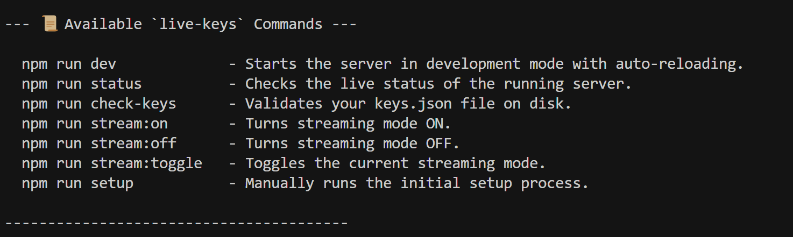
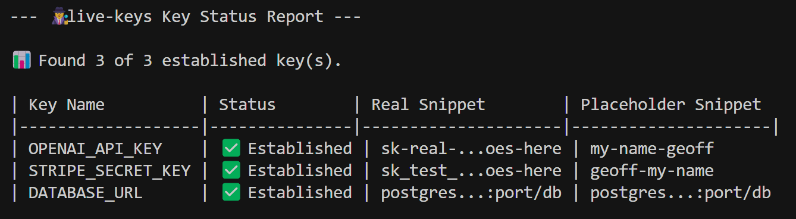

# live-keys

*Designed to make building in public easier*

[](https://github.com/computerlegs/live-keys/releases)
[](LICENSE)

`live-keys` is an Express-based tool that helps you build in public more safely. It runs as a separate local server, acting as a simple proxy for your API keys, preventing them from being exposed during live streams, videos, or presentations.

⚠️ You will need to refactor the way your application handles API calls, or use live-keys foundation to build demo apps.

✅ This is essentially an agnostic, open source, cross compatible version of "secrets" that anyone can use.



| Feature / Aspect | Traditional `.env` Approach | `live-keys` Approach |
| :--- | :--- | :--- |
| **`.env` File Content** | Contains the actual secret key.<br> `API_KEY="sk-real-xxxxxxxx"` | Contains the URL of the key server.<br>`LIVE_KEYS_SERVER_URL="http://localhost:3666"` |
| **Secret Storage** | The real secret is stored in the `.env` file **within your main project's directory.** | The real secret is stored in a separate `keys.json` file, managed **only by the `live-keys` server.** |
| **Application Code** | Synchronously reads the key directly from the environment.<br>`const key = process.env.API_KEY;` | Asynchronously fetches the key from the `live-keys` local server.<br>`const key = await getApiKey('API_KEY');` |
| **Workflow for Streaming** | **Manual & Risky:**<br>1. Manually edit `.env` to replace the real key with a fake one.<br>2. Restart the application.<br>3. Remember to **never** show the `.env` file. | **Simple & Safe:**<br>1. Run a single command: `npm run stream:on`.<br>2. The application continues running without changes. |
| **Risk of Exposure** | **High.** If you accidentally show the `.env` file, `console.log(process.env)`, or a debugger variable, the **real secret is exposed.** | **Low.** The most you can expose is the placeholder value or the local server URL. |
| **Complexity** | **Very Simple.** This is the standard, built-in method for handling secrets in most frameworks. | **Adds a layer.** It requires running a second, separate server process alongside your main application. |

Your application code uses that single URL as a base. It then appends the name of the secret it needs to the end of the URL.
Here is a code example of how your application would fetch two different keys:

```javascript
const serverUrl = process.env.LIVE_KEYS_SERVER_URL;

// Fetch the OpenAI key
const openaiResponse = await fetch(`${serverUrl}/keys/OPENAI_API_KEY`);
const openaiData = await openaiResponse.json();
const openaiKey = openaiData.value; // This is the actual key/placeholder

// Fetch the Stripe key
const stripeResponse = await fetch(`${serverUrl}/keys/STRIPE_SECRET_KEY`);
const stripeData = await stripeResponse.json();
const stripeKey = stripeData.value; // This is the actual key/placeholder
```

---

## About The Project

You can use this tool **any time your screen, terminal, or browser's developer tools might be visible to others.** This includes live streams, recorded videos, pair programming sessions with external collaborators, or any situation where you are sharing your development environment publicly.

### Target Audience
*   **Live Coding Streamers and YouTubers:** The primary audience, who can code with real APIs without fear of accidental exposure.
*   **Developers Building in Public, Presentations and at Demos:** Anyone giving a live talk or demo.
*   **Open-Source Developers:** Anyone recording a GIF, streaming a feature build, or sharing their screen.
*   **Educators and Tutorial Creators:** Teachers demonstrating authentic, end-to-end development workflows.

### Core Features



-   **Local Key Server**: A simple Express server to fetch your keys.
-   **Streaming Mode Toggle**: Instantly switch between serving real keys (dev mode) and placeholder keys (stream mode).
-   **Configurable Strict Mode**: Choose whether the server returns a hard `404 Not Found` error or a friendly `null` value for missing keys.
-   **Pre-Commit Git Hook**: Optional hook to prevent you from accidentally committing real keys.
-   **Request History Log**: A persistent log of the last 15 key requests for easy debugging.

---

### How does it affect coding?

*This is a critical point!*

 **You do need to write code differently in your main application to use `live-keys`.**

It represents a fundamental shift from a **synchronous, direct-access** pattern to an **asynchronous, request-based** pattern for handling your secrets.

Don't use it for production development, use it for public development.

Here is a  breakdown of the change:

---

### Before `live-keys`: Direct & Synchronous

Your code assumes the secret is immediately available in the environment.

*   **Logic:** "Get the variable named `OPENAI_API_KEY` from `process.env` right now."
*   **Code:**
    ```javascript
    // The key is available instantly.
    const apiKey = process.env.OPENAI_API_KEY; 

    // You can use it immediately.
    const openai = new OpenAI({ apiKey: apiKey }); 
    ```

---

### After `live-keys`: Indirect & Asynchronous

Your code must now *ask* another service (the `live-keys` server) for the secret and *wait* for a response.

*   **Logic:** "Send a network request to the `live-keys` server for the key named `OPENAI_API_KEY`, and wait for it to reply with the value."
*   **Code:**
    ```javascript
    // You must use async/await because it's a network request.
    async function initializeApi() {
      const liveKeysUrl = process.env.LIVE_KEYS_SERVER_URL;
      const response = await fetch(`${liveKeysUrl}/keys/OPENAI_API_KEY`);
      const data = await response.json();
      const apiKey = data.value; // The value can now be used.

      const openai = new OpenAI({ apiKey: apiKey });
    }

    // You have to call the async function to start your app.
    initializeApi();
    ```

### Why This Change is Necessary and Powerful

This change in code, while requiring an adjustment, is precisely what makes `live-keys` secure and effective:

1.  **Decoupling:** Your main application is no longer directly coupled to the secret. It doesn't know the value, only how to ask for it.
2.  **Centralized Control:** This allows the `live-keys` server to act as a central switch. When you run `npm run stream:on`, it changes the value that gets sent back to your app, without your app ever needing to know or change.
3.  **No Leaks:** Because the real secret is never loaded into your main application's `process.env` when streaming, it's impossible for a stray `console.log` or debugger to accidentally expose it.

## Getting Started

This section will guide you through setting up and running `live-keys`.

### Prerequisites
- **Node.js**: v18.0.0 or higher.
- **npm**: Included with Node.js.

### Installation

1.  **Install the package**
    ```bash
    npm install
    ```
    This command installs dependencies and creates `keys.json` and `live-keys.config.json` from templates.

2.  **Configure Your Keys & Features**
    -   **`keys.json`**: Add your real and placeholder API keys.
    -   **`live-keys.config.json`**: Configure the server's features.
        -   `strictMode` (boolean): If `true`, requests for missing keys return a `404 Not Found`. Defaults to `false`.
        -   `gitHook` (object): Configures the pre-commit hook.
            -   `enabled` (boolean): If `true`, the hook will run. Defaults to `false`.
            -   `mode` (string): Can be `'warn'` or `'block'`. Defaults to `'warn'`.

3.  **Set Up the Git Hook (Optional, but Recommended)**
    We recommend using `husky` to manage the git hooks reliably.
    ```bash
    npm install husky --save-dev
    npx husky install
    npx husky add .husky/pre-commit "node scripts/pre-commit.js"
    ```

---

## Usage

### Running the Server
```bash
npm run dev
```
The server will start with a detailed banner confirming its status.

### Command-Line Interface (CLI)

You can control the server and perform checks using the following commands:

#### Controlling Streaming Mode
-   **`npm run stream:on`**: Turns streaming mode ON.
-   **`npm run stream:off`**: Turns streaming mode OFF.
-   **`npm run stream:toggle`**: Toggles the current mode.

#### Diagnostic Commands
-   **`npm run status`** (or `npx status`): Checks the live server's status, mode, and key request history.
-   **`npm run check-keys`** (or `npx check-keys`): Validates your `keys.json` file.
-   **`npm run key-commands`** (or `npx key-commands`): Displays a list of all available commands.

### Advanced Usage

#### Programmatic Access (Client-Side Helper)
For tighter integration, a client-side helper library is available in the `/code-base-files` directory. See the `README.md` in that directory for full instructions.

#### API Documentation
For detailed information on the server's endpoints, see the official `API.md` file in the project root.

#### API Endpoints
-   `GET /keys/:name`: Fetches a key. Returns `{ "key": "...", "value": "..." }` on success.
-   `GET /health`: Raw health check endpoint. Returns server status, mode, and request history.
-   `POST /stream-mode/toggle`: Toggles streaming mode. Accepts an optional body (`{ "mode": "on" }` or `{ "mode": "off" }`) to set a specific state.
-   `GET /config-check`: Validates the `keys.json` file.

### Testing Your Setup

You can perform a simple end-to-end test to validate the entire workflow.

**1. `fake-api.js` (A mock of a real API)**
```javascript
const http = require('http');
// This key must match a 'real' key in your keys.json
const REAL_API_KEY = 'sk-real-openai-key-goes-here'; 

http.createServer((req, res) => {
  if (req.headers['authorization'] === `Bearer ${REAL_API_KEY}`) {
    res.writeHead(200, {'Content-Type': 'application/json'}).end(JSON.stringify({ message: '✅ Success!' }));
  } else {
    res.writeHead(401, {'Content-Type': 'application/json'}).end(JSON.stringify({ message: '❌ Unauthorized' }));
  }
}).listen(4001, () => console.log('Fake API listening on http://localhost:4001'));
```

**2. `run-test.js` (A script that simulates your app)**
```javascript
async function runTest() {
  const res = await fetch('http://localhost:3666/keys/OPENAI_API_KEY');
  const { value: apiKey } = await res.json();
  const apiRes = await fetch('http://localhost:4001', { headers: { 'Authorization': `Bearer ${apiKey}` } });
  console.log(`Fake API responded with: ${await apiRes.text()}`);
}
runTest();
```
Run `node test-app/fake-api.js` and `npm run dev` in separate terminals. Then run `node test-app/run-test.js`. Toggle streaming mode on and off to see the test succeed and fail.

---
## Deployment
For production environments, it is recommended to build the project and run the compiled JavaScript output.

1.  **Build the project:**
    ```bash
    npm run build
    ```
    This command uses `tsc` to compile the TypeScript files from `src/` into the `dist/` directory.

2.  **Run the production server:**
    ```bash
    npm start
    ```
    This command runs the compiled `dist/server.js` file directly with Node.js.

---
## Contributing
Open to contribution or collaboration, also, feel free to fork or clone this repo.

If you wish to contribute, please fork the repository and use a feature branch. Pull requests are warmly welcome. Before submitting a pull request, please ensure your code adheres to the existing style by running:
```bash
npm run lint
```

---
## License
Distributed under the MIT License. See `LICENSE` for more information.

---
## Contact
Josh Reinhardt - *Your Contact Information*
Project Link: [https://github.com/computerlegs/live-keys](https://github.com/computerlegs/live-keys)
