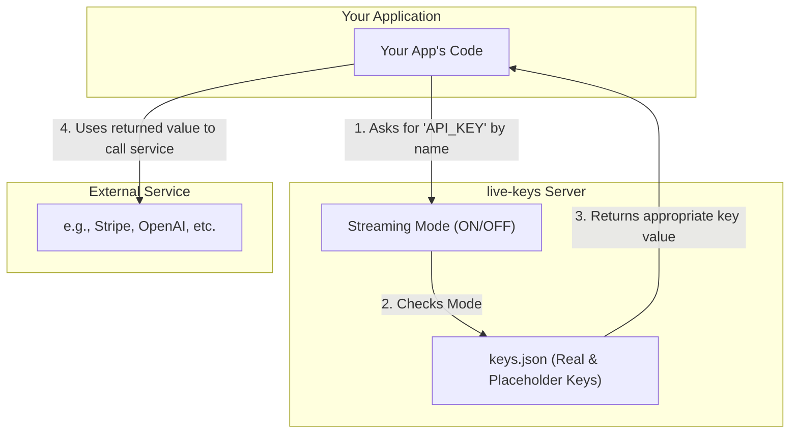
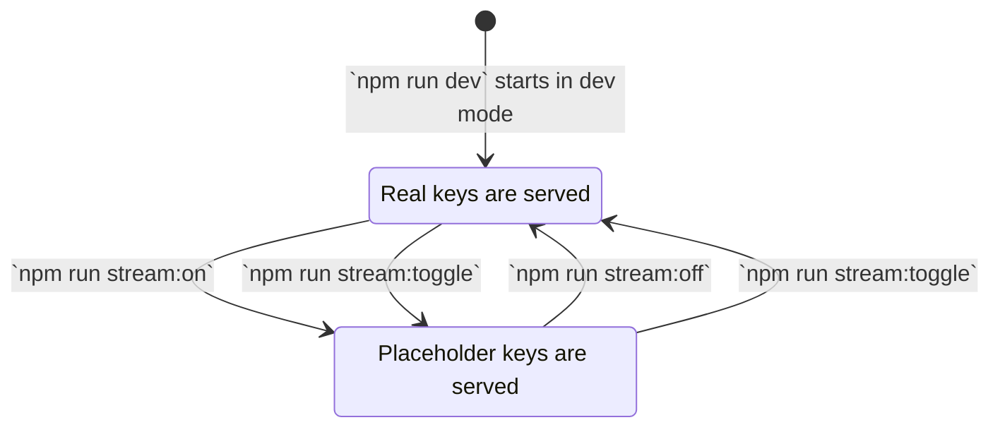

# How to Use `live-keys`

This guide provides a comprehensive walkthrough for setting up, using, and testing `live-keys`. The goal is to ensure you can safely build applications in a public setting without fear of exposing your secret API keys.

## Core Concept: The "Key Vault" Model

The most important concept to understand is that `live-keys` acts as a separate, local "key vault." Your application no longer stores secrets itself; instead, it asks the `live-keys` server for a key when it's needed. This server then decides whether to provide the real key or a safe placeholder value, based on whether you are in "Streaming Mode."



---

## 1. Installation and Setup

Getting started involves installing the package, which automatically sets up the necessary configuration files.

### Prerequisites
- **Node.js**: v18.0.0 or higher
- **npm**: Included with Node.js

### Step-by-Step Installation

1.  **Install the package** in your project's root directory.
    ```bash
    npm install live-keys
    ```
    This command does two things:
    - Installs the necessary dependencies.
    - Creates two new files: `keys.json` and `live-keys.config.json`.

2.  **Configure `keys.json`**
    This file is your key vault. You need to replace the template values with your actual keys.

    *Example `keys.json`:*
    ```json
    {
      "keys": {
        "OPENAI_API_KEY": {
          "real": "sk-xxxxxxxxxxxxxxxxxxxxxxxxxxxx",
          "placeholder": "my-openai-placeholder"
        },
        "STRIPE_SECRET_KEY": {
          "real": "sk_test_xxxxxxxxxxxxxxxxxxxxxx",
          "placeholder": "my-stripe-placeholder"
        }
      }
    }
    ```

3.  **Configure `live-keys.config.json` (Optional)**
    This file lets you configure advanced features. For most users, the defaults are fine.
    - `strictMode`: If `true`, the server returns a `404 Not Found` for missing keys.
    - `gitHook`: Enables a pre-commit check to prevent you from accidentally committing real keys.

    *Example `live-keys.config.json`:*
    ```json
    {
      "strictMode": false,
      "features": {
        "gitHook": {
          "enabled": true,
          "mode": "block"
        }
      }
    }
    ```

---

## 2. Integrating `live-keys` with Your Application

To use `live-keys`, you must modify your application code to fetch keys from the server instead of from a `.env` file.

### Step 1: Update Your `.env` File
Your main application's `.env` file should no longer contain secrets. It should only contain the URL of the `live-keys` server.

```ini
# .env file in YOUR application
LIVE_KEYS_SERVER_URL="http://localhost:3666"
```

### Step 2: Modify Your Application Code
Create a helper function to fetch keys from the `live-keys` server. This code will live in your main application.

*Example Client-Side Helper:*
```javascript
// A helper function to get keys from the live-keys server
async function getApiKey(keyName) {
  const serverUrl = process.env.LIVE_KEYS_SERVER_URL;
  if (!serverUrl) {
    throw new Error("LIVE_KEYS_SERVER_URL is not defined in your environment.");
  }

  try {
    const response = await fetch(`${serverUrl}/keys/${keyName}`);
    if (!response.ok) {
      console.error(`Failed to fetch key '${keyName}' from live-keys server.`);
      return null;
    }
    const data = await response.json();
    return data.value;
  } catch (error) {
    console.error("Could not connect to the live-keys server. Is it running?");
    return null;
  }
}

// How to use the helper in your application
async function makeApiCall() {
  const apiKey = await getApiKey('OPENAI_API_KEY');
  if (apiKey) {
    // Now use the apiKey to call the external service
    console.log(`Using key: ${apiKey}`);
  }
}

makeApiCall();
```

---

## 3. The Development Workflow

This is how you use `live-keys` on a daily basis.

### Step 1: Start the `live-keys` Server
In a terminal, navigate to the directory where you installed `live-keys` and run:
```bash
npm run dev
```
This will start the key server. Keep this terminal window open.

### Step 2: Start Your Main Application
In a *separate* terminal, start your main application as you normally would (e.g., `npm run dev`, `npm start`). Your application will now be able to communicate with the `live-keys` server.

### Step 3: Control the Streaming Mode
This is the core of the `live-keys` workflow. You can toggle between serving real keys and placeholder keys with simple commands.



- **To start streaming safely:**
  ```bash
  npm run stream:on 
  ```
  The server will now respond with your placeholder values.

- **To go back to developing with real data:**
  ```bash
  npm run stream:off
  ```
  The server will now serve your real keys.

### Step 4: Use Diagnostic Commands
At any time, you can check the status of the server and your configuration.

- **Check Server Status and Key History:**
  ```bash
  npm run status
  ```
  This command contacts the running server and prints a report, including the current mode and a history of the last 15 key requests. This is useful for debugging.

- **Validate `keys.json`:**
  ```bash
  npm run check-keys
  ```
  This command reads your `keys.json` file from disk and reports which keys have real values versus which ones are still using the default template values.

- **List All Commands:**
  ```bash
  npm run key-commands
  ```
  Displays a helpful list of all available commands.

---

## 4. Testing Your Integration

`live-keys` comes with a simple test application to help you verify that everything is working correctly.

### End-to-End Test

1.  **Start the `live-keys` server** in one terminal:
    ```bash
    npm run dev
    ```
2.  **Start the mock API** in a second terminal. This simulates a real external service (like Stripe or OpenAI).
    ```bash
    node test-app/fake-api.js
    ```
3.  **Run the test script** in a third terminal. This script will fetch a key from `live-keys` and use it to call the mock API.
    ```bash
    node test-app/run-test.js
    ```

Now, use the `stream:on` and `stream:off` commands. You will see the test script succeed when streaming is off (using the real key) and fail when streaming is on (using the placeholder). This confirms that your setup is working perfectly.

---

## 5. Troubleshooting / FAQ

**Q: What happens if I forget to start the `live-keys` server?**

A: The client-side helper function provided in this guide includes error handling. It will detect that it cannot connect to the server and log a helpful error message to your console without crashing your application.

**Q: What if I request a key that doesn't exist in `keys.json`?**

A: By default (`strictMode: false`), the server will return a `null` value. If you enable `strictMode: true` in `live-keys.config.json`, the server will respond with a `404 Not Found` error, which may be more useful for debugging.

**Q: Can I use this with any programming language?**

A: Yes. `live-keys` is just a simple HTTP server. Any language or framework that can make an HTTP/S request can fetch keys from it. The client-side helper provided is just a JavaScript example. 